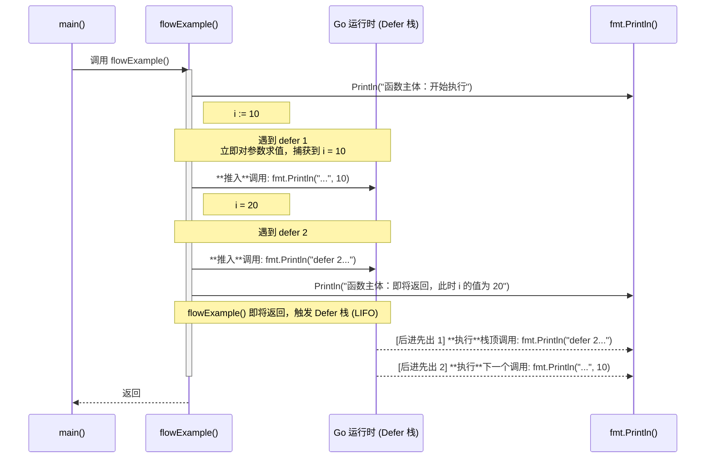

我们将使用下面这个例子来制作时序图，这个例子同时展示了 **LIFO（后进先出）** 和 **参数立即求值** 这两个核心特性。

### 示例代码

```go
package main

import "fmt"

func flowExample() {
	fmt.Println("函数主体：开始执行")

	i := 10

	// 1. 注册第一个 defer，此时 i 的值是 10
	defer fmt.Println("defer 1 (后执行): 此处 i 的值为", i)

	i = 20 // 修改 i 的值

	// 2. 注册第二个 defer
	defer fmt.Println("defer 2 (先执行)")

	fmt.Println("函数主体：即将返回，此时 i 的值为", i)
}

func main() {
	flowExample()
}
```

#### 预期输出

在看时序图之前，我们先看预期输出，这样可以带着问题去理解流程：

```
函数主体：开始执行
函数主体：即将返回，此时 i 的值为 20
defer 2 (先执行)
defer 1 (后执行): 此处 i 的值为 10
```

-----

### Defer 流程时序图

下面是上述代码执行流程的可视化时序图。



